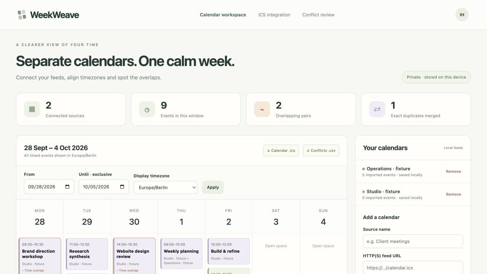
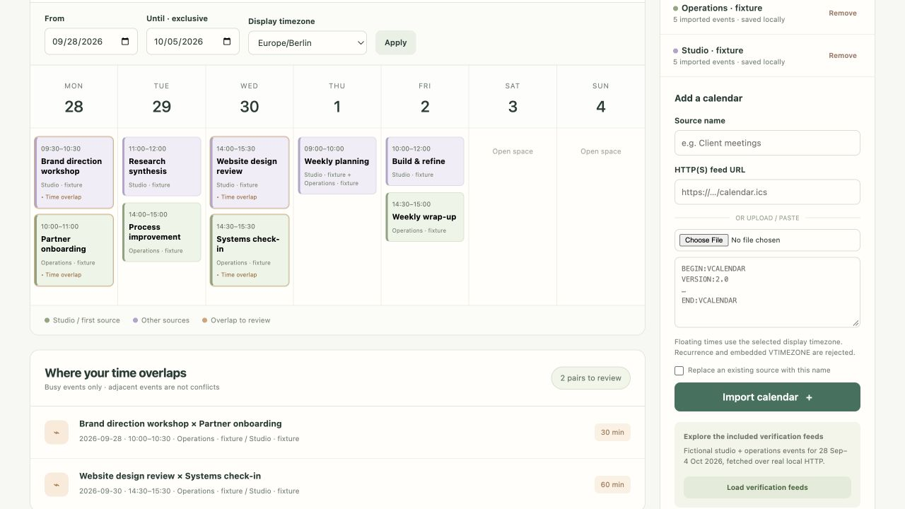

# WeekWeave — Calendar Feed Integration

A working local calendar integration app. Import ICS text, upload an `.ics` file or fetch a configured HTTP(S) feed; normalize timed events to an IANA timezone; merge exact duplicate events across sources; find overlapping busy periods; and export the selected window as consolidated ICS or conflict CSV.

An independent project by Ismail Habib. Screenshots show the running application; any records shown are labelled verification data.

## Screenshots



Separate verification feeds combined into one timezone-aligned calendar.



Actual merged calendar events and computed overlap intervals with source labels.

## Features

- Import pasted ICS, uploaded files or explicitly requested HTTP(S) feeds.
- IANA timezone normalization, exact cross-source deduplication and source evidence.
- Busy-overlap analysis with date-window filters and persisted source data.
- Consolidated ICS and spreadsheet-safe conflict CSV exports.

## Quick start

Run these commands from the repository directory.

Python 3.11+ is required. The implementation uses the Python standard library and the operating system’s IANA timezone database.

```sh
python3 app.py
```

Open **http://127.0.0.1:8112**. `run.sh` is an equivalent macOS/Linux launcher. On Windows run `py -3 app.py`; if the system has no IANA timezone database, install Python’s optional `tzdata` package first (`py -3 -m pip install tzdata`). Windows has not been verified in this project.

The app binds only to loopback. Set `PORT` to change the port. SQLite source/event data is created at `data/weekweave.sqlite3`; set `WEEKWEAVE_DB` to override the location. Stop with Ctrl+C. Stop the application before copying the database for a backup.

## First workflow

1. Choose **Load verification feeds**. The application fetches `fixtures/studio.ics` and `fixtures/operations.ics` through its real local HTTP endpoints.
2. The view switches to 28 September–4 October 2026. Ten imported source events produce nine consolidated events, one exact duplicate merge and two overlapping pairs.
3. Inspect a calendar event to see its source, original UID, timestamp, location and status.
4. Change the display timezone and choose **Apply**. Absolute instants are preserved; displayed times change.
5. Download **Calendar .ics** or **Conflicts .csv** for the current date window.
6. Add your own file, paste ICS text or enter a feed URL. Use a distinct source name. Replacing a name requires the explicit replacement checkbox.

A failed import leaves the previous source intact. Source removal requires a browser confirmation and changes only local data, never the originating calendar.

## Remote feeds

By default, only loopback HTTP(S) URLs are allowed. To fetch a remote HTTPS feed, opt in when launching:

```sh
ALLOW_REMOTE_FETCH=1 python3 app.py
```

Remote HTTP additionally requires `ALLOW_INSECURE_HTTP=1`. Redirects are not followed; enter the final feed URL. Responses have an 8-second socket timeout and 2 MB size limit. A feed URL is retained locally with the source; do not include confidential access tokens in a URL you plan to share. OAuth, CalDAV, Microsoft Graph, Google Calendar API authentication and writeback are not implemented.

## Supported iCalendar subset

This parser intentionally supports a documented subset, not every RFC 5545 calendar.

**Supported event data**

- One complete `VCALENDAR` with `VERSION:2.0`, containing independent `VEVENT` entries.
- Required `UID` and `DTSTART`; `DTEND` is supported. A missing end is the next day for all-day events and a zero-duration instant for timed events.
- `DTSTART`/`DTEND` in UTC (`…Z`), a resolvable IANA `TZID`, floating local time (interpreted using the import timezone), or `VALUE=DATE` all-day dates.
- `SUMMARY`, `DESCRIPTION` and `LOCATION`; folded input lines and text escaping for comma, semicolon, backslash and newline.
- `STATUS` and `TRANSP`. Cancelled and transparent/free events remain visible/exportable but are excluded from busy-overlap checks.
- A limited set of standard metadata properties and `X-` extensions are accepted. Organizer, attendee, category, URL, sequence, timestamps and other accepted auxiliary metadata are not retained in the normalized export.

**Rejected rather than silently approximated**

- Recurrence: `RRULE`, `RDATE`, `EXDATE`, `EXRULE`, `RECURRENCE-ID`. Expand recurring entries into individual events before import.
- `DURATION`; provide `DTEND` instead.
- `ALTREP` parameters on text fields; include the actual text content instead.
- Embedded `VTIMEZONE`, `VALARM`, VTODO and other nested components. Use UTC or an IANA `TZID` and remove unsupported components.
- Ambiguous or nonexistent floating/TZID local times at daylight-saving transitions; use unambiguous UTC timestamps for those events.
- Invalid calendar structure, unknown properties outside the documented subset, duplicate UIDs within one source, conflicting DTSTART/DTEND types, unsupported scheduling methods and non-Gregorian calendars.

Supported simple property parameters do not include every RFC parameter syntax. Prefer exported source data normalized to the subset above. An unsupported file produces an actionable error and no partial save.

## Merge, overlap and export rules

- Exact events merge across sources only when the original UID **and** normalized retained content match. Distinct definitions sharing a UID remain distinct and are not silently overwritten.
- Timed events are stored and ordered as UTC instants, including the repeated daylight-saving hour. All-day events retain their original date ranges and have an exclusive end date.
- Busy overlaps use half-open intervals, so an event ending when the next one starts is not a conflict. Overlap durations are clipped to the selected window.
- The date filter is `[start date, end date)`, interpreted in the display timezone. The range is limited to 93 days, analysis to 1,000 events and 5,000 overlapping pairs, import to 5,000 events per source, and total storage to 10,000 events.
- Export includes full events intersecting the selected window rather than truncating event start/end times. Busy-overlap durations are separately clipped to the window.
- Consolidated ICS exports use stable generated UIDs to avoid cross-source collisions, retain original UIDs in `X-ORIGINAL-UID`, annotate source names, output timed entries in UTC and preserve all-day dates.
- UTF-8 output is folded at 75 octets with CRLF line endings. This normalization is not a lossless round trip of every original calendar property.
- CSV formula prefixes are neutralized for spreadsheet use.

## Security and deployment scope

This is a local, single-user workspace. JSON POST bodies and Host/Origin checks protect its loopback interface. It is not a hosted calendar account service and has no login, encrypted-at-rest database, automatic refresh, push subscriptions, availability booking or team access management. API fetches occur only when the user imports a feed.

## API

| Route | Purpose |
|---|---|
| `GET /api/state?timezone=Europe/Berlin&start=2026-09-28&end=2026-10-05` | Sources, normalized events and overlap analysis |
| `POST /api/import` | JSON `{name, text, url, timezone, replace}`; URL takes precedence if nonempty |
| `POST /api/remove` | JSON `{source_id}`; removes a local source |
| `GET /api/export.ics?...` | Consolidated ICS using the same filter parameters |
| `GET /api/conflicts.csv?...` | Conflict CSV using the same filter parameters |
| `GET /fixtures/studio.ics` | Fictional source calendar over local HTTP |
| `GET /fixtures/operations.ics` | Second fictional source calendar over local HTTP |

## Verify

```sh
python3 -m unittest -v test_app.py
```

Thirteen automated tests use temporary databases and real loopback HTTP feed requests. `TEST_RESULTS.md` summarizes coverage and `test-run.txt` contains the captured run.

## License

[MIT License](LICENSE) — Copyright (c) 2026 Ismail Habib.
